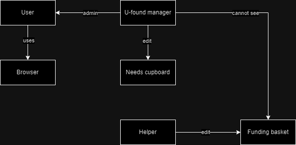
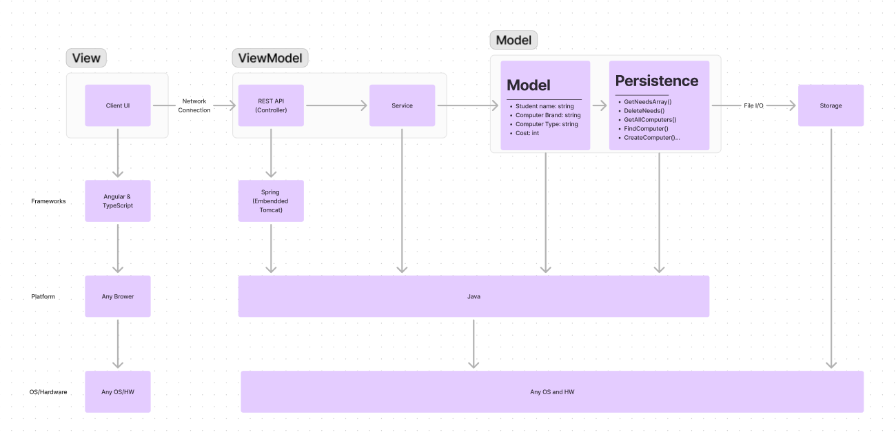

# PROJECT Design Documentation

> _The following template provides the headings for your Design
> Documentation.  As you edit each section make sure you remove these
> commentary 'blockquotes'; the lines that start with a > character
> and appear in the generated PDF in italics but do so only **after** all team members agree that the requirements for that section and current Sprint have been met. **Do not** delete future Sprint expectations._

## Team Information
* Team name: TEAMNAME
* Team members
  * Maxwell Falk
  * Tony Butler
  * George Verkhovsky
  * [REDACTED]

## Executive Summary

Makes a host to run a website, has ui, does something relevant to input detected within the ui, updates the ui accordingly.

### Purpose
Our project is a charity page for businesses to allocate funding for their needs, assuming their needs are computers,
because that was our idea of charity. This needs to be done in a somewhat user-friendly manner, with a basic login
page, and simple, accessible systems elsewise to promote some ease of use in tracking and maintaining certain business
expenditures.

### Glossary and Acronyms
> _**[Sprint 2 & 4]** Provide a table of terms and acronyms._

| Term | Definition |
  
  Need: a unit of charity, tracking the name, quantity, cost, brand, and other metadata to mediate business effectively.

  
|------|------------|
| SPA | Single Page |

## Requirements

This section describes the features of the application.

> _In this section you do not need to be exhaustive and list every
> story.  Focus on top-level features from the Vision document and
> maybe Epics and critical Stories._

### Definition of MVP
> _**[Sprint 2 & 4]** Provide a simple description of the Minimum Viable Product._
Has ui, basic functions GET POST PUT DELETE etc, can run without crashing, solid code coverage from unit tests.

### MVP Features
>  _**[Sprint 4]** Provide a list of top-level Epics and/or Stories of the MVP._

### Enhancements
> _**[Sprint 4]** Describe what enhancements you have implemented for the project._

## Application Domain

This section describes the application domain.

> _**[Sprint 2 & 4]** Provide a high-level overview of the domain for this application. You
> can discuss the more important domain entities and their relationship
> to each other._

Model-view-viewmodel type architecture, ui interacts with the model via the viewmodel, based around GET, POST, etc interactions in the model, basic unit is the Need, has users and ufund managers, both of which use the browser, dependent on user login, edits the need cupboard, uses the helper to edit other resources such as the funding basket, does not however see the basket directly.

## Architecture and Design

This section describes the application architecture.

### Summary

The following Tiers/Layers model shows a high-level view of the webapp's architecture. 
**NOTE**: detailed diagrams are required in later sections of this document.
> _**[Sprint 1]** (Augment this diagram with your **own** rendition and representations of sample system classes, placing them into the appropriate M/V/VM (orange rectangle) tier section. Focus on what is currently required to support **Sprint 1 - Demo requirements**. Make sure to describe your design choices in the corresponding _**Tier Section**_ and also in the _**OO Design Principles**_ section below.)_

The web application, is built using the Model–View–ViewModel (MVVM) architecture pattern. 

The Model stores the application data objects including any functionality to provide persistance. 

The View is the client-side SPA built with Angular utilizing HTML, CSS and TypeScript. The ViewModel provides RESTful APIs to the client (View) as well as any logic required to manipulate the data objects from the Model.

Both the ViewModel and Model are built using Java and Spring Framework. Details of the components within these tiers are supplied below.

### Overview of User Interface

This section describes the web interface flow; this is how the user views and interacts with the web application.

> _Provide a summary of the application's user interface.  Describe, from the user's perspective, the flow of the pages in the web application._

### View Tier
> _**[Sprint 4]** Provide a summary of the View Tier UI of your architecture.
> Describe the types of components in the tier and describe their
> responsibilities.  This should be a narrative description, i.e. it has
> a flow or "story line" that the reader can follow._

> _**[Sprint 4]** You must  provide at least **2 sequence diagrams** as is relevant to a particular aspects 
> of the design that you are describing.  (**For example**, in a shopping experience application you might create a 
> sequence diagram of a customer searching for an item and adding to their cart.)
> As these can span multiple tiers, be sure to include an relevant HTTP requests from the client-side to the server-side 
> to help illustrate the end-to-end flow._

> _**[Sprint 4]** To adequately show your system, you will need to present the **class diagrams** where relevant in your design. Some additional tips:_
 >* _Class diagrams only apply to the **ViewModel** and **Model** Tier_
>* _A single class diagram of the entire system will not be effective. You may start with one, but will be need to break it down into smaller sections to account for requirements of each of the Tier static models below._
 >* _Correct labeling of relationships with proper notation for the relationship type, multiplicities, and navigation information will be important._
 >* _Include other details such as attributes and method signatures that you think are needed to support the level of detail in your discussion._

### ViewModel Tier
> _**[Sprint 1]** List the classes supporting this tier and provide a description of there purpose._

> _**[Sprint 4]** Provide a summary of this tier of your architecture. This
> section will follow the same instructions that are given for the View
> Tier above._

> _At appropriate places as part of this narrative provide **one** or more updated and **properly labeled**
> static models (UML class diagrams) with some details such as associations (connections) between classes, and critical attributes and methods. (**Be sure** to revisit the Static **UML Review Sheet** to ensure your class diagrams are using correct format and syntax.)_
> 

### Model Tier

getComputer - attempts to retrieve a need according to input, returns an appropriate response entity upon completion
searchNeeds - attempts to retrieve several needs according to input, returns an appropriate response entity upon completion
createComputer - attempts to create a new need according to input, returns an appropriate response entity upon completion
deleteComputer - attempts to remove a current need according to input, returns an appropriate response entity upon completion
findComputers - attempts to retrieve all needs, returns an appropriate response entity upon completion
updateComputer - attempts to rewrite a need according to input or create a new one, returns an appropriate response entity upon completion

> _**[Sprint 2, 3 & 4]** Provide a summary of this tier of your architecture. This
> section will follow the same instructions that are given for the View
> Tier above._

Contains all the basic functions and implementations needed for the api of the project, allowing for interactions with
values displayed in the view.

> _At appropriate places as part of this narrative provide **one** or more updated and **properly labeled**
> static models (UML class diagrams) with some details such as associations (connections) between classes, and critical attributes and methods. (**Be sure** to revisit the Static **UML Review Sheet** to ensure your class diagrams are using correct format and syntax.)_
> 

## OO Design Principles

> _**[Sprint 1]** Name and describe the initial OO Principles that your team has considered in support of your design (and implementation) for this first Sprint._

We focused on low coupling and simplifying the functions of methods, reducing overreliance of any classes on any others,
and keeping the scope of classes within the initial and intended purpose of the file.

> _**[Sprint 2, 3 & 4]** Will eventually address upto **4 key OO Principles** in your final design. Follow guidance in augmenting those completed in previous Sprints as indicated to you by instructor. Be sure to include any diagrams (or clearly refer to ones elsewhere in your Tier sections above) to support your claims._

> _**[Sprint 3 & 4]** OO Design Principles should span across **all tiers.**_

## Static Code Analysis/Future Design Improvements
> _**[Sprint 4]** With the results from the Static Code Analysis exercise, 
> **Identify 3-4** areas within your code that have been flagged by the Static Code 
> Analysis Tool (SonarQube) and provide your analysis and recommendations.  
> Include any relevant screenshot(s) with each area._

> _**[Sprint 4]** Discuss **future** refactoring and other design improvements your team would explore if the team had additional time._

## Testing
> _This section will provide information about the testing performed
> and the results of the testing._

### Acceptance Testing
> _**[Sprint 2 & 4]** Report on the number of user stories that have passed all their
> acceptance criteria tests, the number that have some acceptance
> criteria tests failing, and the number of user stories that
> have not had any testing yet. Highlight the issues found during
> acceptance testing and if there are any concerns._

### Unit Testing and Code Coverage
> _**[Sprint 4]** Discuss your unit testing strategy. Report on the code coverage
> achieved from unit testing of the code base. Discuss the team's
> coverage targets, why you selected those values, and how well your
> code coverage met your targets._

>_**[Sprint 2, 3 & 4]** **Include images of your code coverage report.** If there are any anomalies, discuss
> those._

## Ongoing Rationale
>_**[Sprint 1, 2, 3 & 4]** Throughout the project, provide a time stamp **(yyyy/mm/dd): Sprint # and description** of any _**mayor**_ team decisions or design milestones/changes and corresponding justification._
